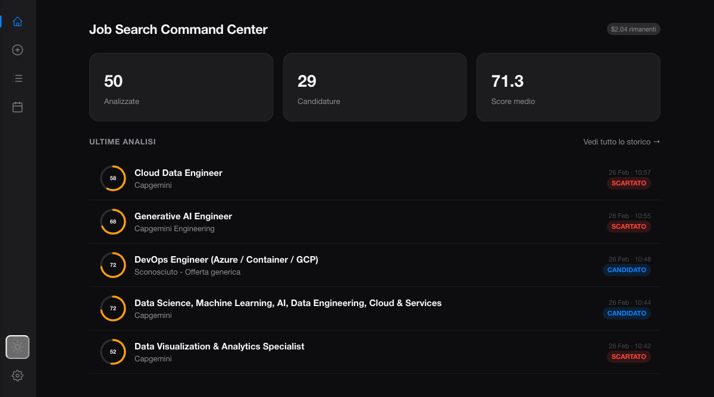
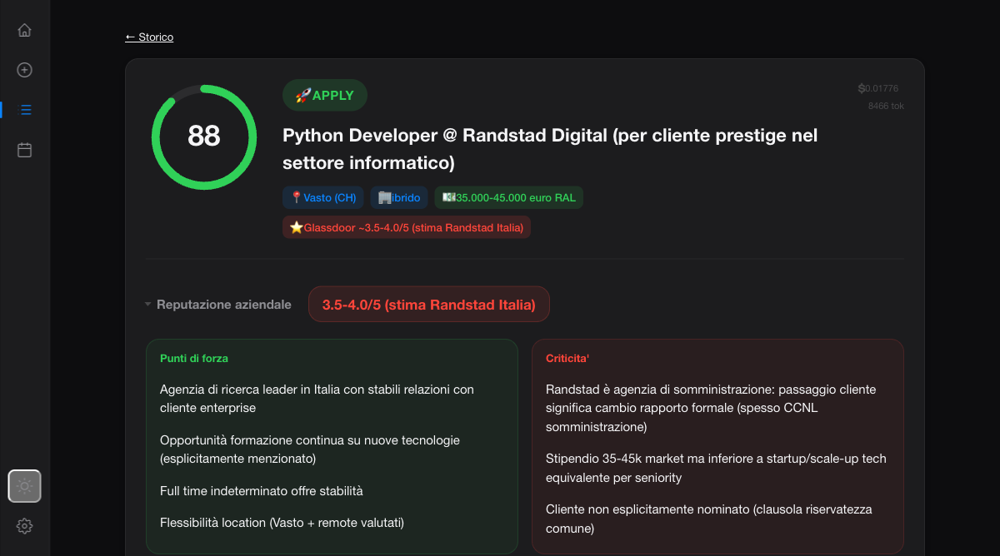

# Job Search Command Center

An AI-powered job search platform built with a microservices architecture. Paste your CV once, then analyze any job listing to get compatibility scores, skill gap analysis, interview preparation, and automated outreach tools.


---

## Architecture

```
                    ┌─────────────────┐
    :80             │    frontend     │
  ──────────────────│  (nginx 1.27)   │
                    └────────┬────────┘
                             │ proxy_pass
                    ┌────────▼────────┐
    :8000 internal  │    backend      │
                    │ (uvicorn/FastAPI)│──── Claude API (Haiku / Sonnet)
                    └────────┬────────┘
                             │
                  ┌──────────┼──────────┐
                  │                     │
           ┌──────▼──────┐     ┌───────▼───────┐
           │     db       │     │    redis      │
           │ PostgreSQL 16│     │  (cache, opt) │
           └──────────────┘     └───────────────┘
```

**4 containers** on a bridge network. Nginx serves static files directly and reverse-proxies everything else to the backend. The backend exposes SSR routes at root level and a versioned JSON API at `/api/v1/` with auto-generated Swagger docs.

---

## Key Features

| Feature | Description |
|---------|-------------|
| **AI Analysis** | Claude Haiku (fast) or Sonnet (deep) evaluate CV-to-job fit with a 0-100 score |
| **Skill Gap Analysis** | Structured gaps with severity, closability, and action plans |
| **Interview Prep** | Likely questions + suggested answers based on your actual CV |
| **Cover Letter** | AI-generated, multi-language, context-aware (uses analysis results) |
| **Follow-up Email** | Automated outreach scaled to days since application |
| **LinkedIn Message** | Connection note + direct message, ready to copy |
| **Batch Analysis** | Queue multiple job listings, process all sequentially |
| **Recruiter Contacts** | CRM per application: name, email, phone, LinkedIn |
| **Company Reputation** | Glassdoor ratings via RapidAPI with 30-day DB cache |
| **Cost Tracking** | Per-analysis cost, daily totals, configurable budget |
| **Email Notifications** | SMTP email alerts for new APPLY analyses, Fernet-encrypted credentials |
| **Audit Trail** | DB-logged user actions (login, analyze, delete, etc.) |
| **Interview Scheduling** | Book interviews with date, recruiter, meeting link; upcoming banner on dashboard |
| **Dashboard** | Stats, top matches, active applications, upcoming interviews at a glance |

---

## Screenshots

| Dashboard | Analysis Result | Cover Letter |
|:---------:|:---------------:|:------------:|
|  |  |  |

> Screenshots not yet captured — see [`docs/screenshots/README.md`](docs/screenshots/README.md) for capture instructions.

---

## Tech Stack

| Layer | Technology | Purpose |
|-------|-----------|---------|
| **Reverse Proxy** | Nginx 1.27 | Static files, SSL termination, load balancing |
| **Backend** | FastAPI + Uvicorn | REST API + SSR (Jinja2) |
| **ORM** | SQLAlchemy 2.0 | Declarative models, UUID PKs, JSONB columns |
| **Migrations** | Alembic | Versioned schema migrations |
| **Database** | PostgreSQL 16 | Persistent storage |
| **Cache** | Redis 7 | API response caching (graceful degradation) |
| **AI** | Anthropic Claude | Analysis, generation, 7-strategy JSON parsing + Pydantic validation |
| **Auth** | Session + bcrypt | Server-side sessions, password hashing |
| **Rate Limiting** | slowapi | Per-IP limits, X-Forwarded-For aware |
| **Security** | Custom middleware | CORS, HSTS, CSP headers, trusted hosts |
| **Encryption** | Fernet (cryptography) | SMTP credential encryption at rest |
| **CI/CD** | GitHub Actions | Lint (ruff) + Frontend lint + Security audit + Test + Docker build |
| **Deploy** | Fly.io / Docker Compose | Single-container PaaS or multi-container local |

---

## Quick Start

### Prerequisites

- [Docker](https://docs.docker.com/get-docker/) + Docker Compose
- An [Anthropic API key](https://console.anthropic.com/)

### Setup

```bash
git clone https://github.com/MK023/JobSearch.git
cd JobSearch

cp .env.example .env
# Edit .env: set ANTHROPIC_API_KEY, ADMIN_EMAIL, ADMIN_PASSWORD

docker compose up -d
```

Open `http://localhost` — the app is served by nginx on port 80.

### First Use

1. Login with your admin credentials
2. Paste your CV in the left panel, click "Salva CV"
3. Paste a job listing in the right panel
4. Pick a model: Haiku (~$0.005/analysis) or Sonnet (~$0.02/analysis)
5. Click "Analizza" and review results
6. Use tools: cover letter, follow-up email, LinkedIn message, contacts

---

## API

All JSON endpoints are versioned under `/api/v1/`. Swagger docs are auto-generated at:

```
http://localhost/api/v1/docs
```

### Endpoint Map

| Method | Path | Description |
|--------|------|-------------|
| POST | `/api/v1/status/{id}/{status}` | Update analysis status |
| DELETE | `/api/v1/analysis/{id}` | Delete analysis |
| POST | `/api/v1/followup-email` | Generate follow-up email |
| POST | `/api/v1/linkedin-message` | Generate LinkedIn message |
| POST | `/api/v1/followup-done/{id}` | Mark follow-up complete |
| GET | `/api/v1/contacts/{id}` | Get contacts for analysis |
| POST | `/api/v1/contacts` | Save contact |
| DELETE | `/api/v1/contacts/{cid}` | Delete contact |
| GET | `/api/v1/spending` | Get spending data |
| PUT | `/api/v1/spending/budget` | Update budget |
| GET | `/api/v1/dashboard` | Dashboard stats |
| POST | `/api/v1/batch/add` | Add to batch queue |
| POST | `/api/v1/batch/run` | Run batch analysis |
| GET | `/api/v1/batch/status` | Batch queue status |
| DELETE | `/api/v1/batch/clear` | Clear batch queue |
| POST | `/api/v1/interviews/{id}` | Create/update interview |
| GET | `/api/v1/interviews/{id}` | Get interview details |
| DELETE | `/api/v1/interviews/{id}` | Delete interview |
| GET | `/api/v1/interviews-upcoming` | Upcoming interviews (48h) |

---

## Project Structure

```
JobSearch/
├── docker-compose.yml              # 4-service orchestration
├── fly.toml                        # Fly.io single-container deploy
├── .env.example                    # Environment template
├── .pre-commit-config.yaml         # Pre-commit hooks (ruff, stylelint)
├── .stylelintrc.json               # Shared stylelint config
├── .github/workflows/ci.yml        # CI pipeline (5 jobs)
│
├── frontend/
│   ├── Dockerfile                  # nginx:1.27-alpine
│   ├── nginx.conf                  # Reverse proxy config
│   ├── templates/                  # Jinja2 SSR templates
│   │   ├── base.html
│   │   ├── index.html
│   │   ├── login.html
│   │   ├── 404.html               # Custom error page
│   │   ├── 500.html               # Custom error page
│   │   └── partials/              # Reusable template fragments
│   │       ├── header.html
│   │       ├── cv_form.html
│   │       ├── analyze_form.html
│   │       ├── result.html
│   │       ├── result_reputation.html
│   │       ├── cover_letter_form.html
│   │       ├── cover_letter_result.html
│   │       ├── followup_alerts.html
│   │       ├── batch.html
│   │       ├── dashboard.html
│   │       ├── history.html
│   │       ├── interview_modal.html
│   │       └── interview_detail.html
│   └── static/
│       ├── css/                    # Modular CSS (stylelint-validated)
│       │   ├── variables.css       # Design tokens
│       │   ├── base.css            # Reset, typography, forms
│       │   ├── layout.css          # Container, header, grid, footer
│       │   ├── components.css      # Buttons, cards, badges, tabs
│       │   └── sections.css        # Page-specific sections
│       └── js/modules/             # Vanilla JS + Alpine.js
│           ├── status.js
│           ├── spending.js
│           ├── dashboard.js
│           ├── batch.js
│           ├── contacts.js
│           ├── followup.js
│           ├── cv.js
│           ├── history.js
│           └── interview.js
│
├── backend/
│   ├── Dockerfile                  # python:3.12-slim
│   ├── requirements.txt
│   ├── alembic.ini                 # Migration config
│   ├── alembic/
│   │   ├── env.py
│   │   └── versions/
│   │       ├── 001_initial_schema.py
│   │       ├── 002_add_audit_logs.py
│   │       ├── 003_add_notification_logs.py
│   │       └── 004_add_interviews.py
│   ├── tests/
│   │   ├── conftest.py             # Fixtures (SQLite in-memory)
│   │   └── test_*.py               # Unit tests (pytest + coverage)
│   └── src/
│       ├── main.py                 # App factory + middleware
│       ├── config.py               # Pydantic settings
│       ├── api_v1.py               # JSON API router aggregator
│       ├── prompts.py              # Token-optimized AI prompts
│       ├── rate_limit.py           # slowapi singleton
│       ├── dependencies.py         # Auth deps
│       ├── database/               # Engine, session, Base
│       ├── auth/                   # Login/logout, bcrypt
│       ├── cv/                     # CV upload/storage
│       ├── analysis/               # Core AI analysis + Pydantic schemas
│       ├── cover_letter/           # AI cover letter gen
│       ├── contacts/               # Recruiter CRM
│       ├── dashboard/              # Spending + stats
│       ├── batch/                  # Queue + batch processing
│       ├── audit/                  # DB audit trail
│       ├── notifications/          # Email alerts (SMTP + Fernet encryption)
│       ├── interview/              # Interview scheduling (1:1 with analysis)
│       └── integrations/
│           ├── anthropic_client.py # Claude API + 7-strategy JSON parsing
│           ├── cache.py            # Redis/Null cache protocol
│           └── glassdoor.py        # Company ratings API
│
└── docs/
    ├── architecture.drawio         # Architecture diagram
    ├── technical.md                # Technical documentation
    └── screenshots/README.md       # Screenshot capture guide
```

---

## Development

### Pre-commit Hooks

Install pre-commit hooks to catch issues before they reach CI:

```bash
pip install pre-commit
pre-commit install

# Run on all files (first time)
pre-commit run --all-files
```

Hooks run automatically on `git commit`: Ruff (lint + format), Stylelint (CSS), trailing whitespace, end-of-file fixer, YAML/JSON validation.

### Commands

```bash
# Live logs (all containers)
docker compose logs -f

# Rebuild after changes
docker compose up -d --build

# Run tests with coverage
cd backend && pytest tests/ -v --cov=src --cov-report=term-missing

# Lint check
ruff check backend/src/ backend/tests/
ruff format --check backend/src/ backend/tests/

# Database shell
docker compose exec db psql -U jobsearch

# Stop
docker compose down

# Stop and wipe data
docker compose down -v
```

The backend container runs with `--reload` — Python changes apply instantly.

---

## Deploy on Fly.io

Single-container deployment (no nginx, no Redis — the backend serves everything):

```bash
fly apps create jobsearch
fly postgres create --name jobsearch-db --region cdg
fly postgres attach jobsearch-db

fly secrets set ANTHROPIC_API_KEY=sk-ant-...
fly secrets set SECRET_KEY=$(openssl rand -hex 32)
fly secrets set ADMIN_EMAIL=you@example.com
fly secrets set ADMIN_PASSWORD=your-secure-password

fly deploy
```

The VM auto-sleeps when idle and cold-starts in ~2-3s.

---

## Cost

| Model | Input | Output | Per analysis |
|-------|-------|--------|-------------|
| Haiku 4.5 | $0.80/MTok | $4.00/MTok | ~$0.005 |
| Sonnet 4.5 | $3.00/MTok | $15.00/MTok | ~$0.02 |

Follow-up emails and LinkedIn messages: ~$0.001 each.

Budget tracking is built-in: set a limit, monitor spending in real-time.

---

## Security

- CORS with configurable origins
- TrustedHost middleware
- Security headers (X-Content-Type-Options, X-Frame-Options, HSTS, Referrer-Policy)
- Rate limiting (60/min global, 10/min on AI routes, 5/min on login)
- bcrypt password hashing
- Session-based auth with configurable TTL
- Nginx as reverse proxy (backend not exposed to host)
- Fernet encryption for SMTP credentials at rest
- DB audit trail for all user actions
- Bandit security scanning + pip-audit dependency audit in CI

---

## License

MIT
